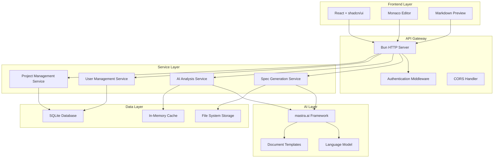

# Design Document

## Overview

智能规范助手平台采用现代化的全栈架构，使用 Bun 作为运行时，shadcn/ui 构建用户界面，mastra.ai 提供 AI 能力。系统设计为单页应用（SPA）配合 RESTful API 后端，支持实时协作和智能文档生成。

核心设计理念：
- **规范驱动**: 基于 Kiro spec 三文件结构（requirements.md, design.md, tasks.md）
- **AI 增强**: 使用 AI 提升文档生成和分析能力
- **用户体验优先**: 现代化界面和流畅的交互体验
- **可扩展性**: 模块化架构支持功能扩展

## Architecture

### System Architecture



### Technology Stack

**Frontend:**
- React 18 with TypeScript
- shadcn/ui component library
- Tailwind CSS for styling
- Plate.js for rich text editing
- React Router for navigation
- Zustand for state management

**Backend:**
- Bun runtime and HTTP server
- TypeScript for type safety
- Hono.js as web framework
- mastra.ai for AI capabilities
- SQLite for structured data
- File system for document storage

**Development Tools:**
- Bun for package management and bundling
- ESLint + Prettier for code quality
- Vitest for testing
- Docker for containerization

## Components and Interfaces

### Frontend Components

#### Plate.js Editor Configuration

```typescript
// Spec-specific editor configurations
const createRequirementsEditor = () => {
  return createPlateEditor({
    plugins: [
      // Basic editing
      createParagraphPlugin(),
      createHeadingPlugin(),
      createListPlugin(),
      createBoldPlugin(),
      createItalicPlugin(),
      
      // Spec-specific plugins
      createUserStoryPlugin(),        // Custom plugin for user story blocks
      createAcceptanceCriteriaPlugin(), // Custom plugin for EARS format
      createRequirementLinkPlugin(),   // Cross-reference requirements
      
      // AI integration
      createAIAssistPlugin(),         // AI suggestions and generation
      createAutoCompletePlugin(),     // Smart auto-completion
    ],
  });
};

const createDesignEditor = () => {
  return createPlateEditor({
    plugins: [
      // Basic editing
      createParagraphPlugin(),
      createHeadingPlugin(),
      createListPlugin(),
      createCodeBlockPlugin(),
      
      // Design-specific plugins
      createMermaidPlugin(),          // Mermaid diagram support
      createArchitecturePlugin(),     // Architecture diagram templates
      createCodeSnippetPlugin(),      // Syntax-highlighted code blocks
      createAPIDocPlugin(),           // API documentation blocks
      
      // Collaboration
      createCommentsPlugin(),         // Inline comments and discussions
      createSuggestionsPlugin(),      // Change suggestions
    ],
  });
};

const createTasksEditor = () => {
  return createPlateEditor({
    plugins: [
      // Basic editing
      createParagraphPlugin(),
      createHeadingPlugin(),
      
      // Task-specific plugins
      createTaskListPlugin(),         // Enhanced task lists with status
      createDependencyPlugin(),       // Task dependency visualization
      createProgressPlugin(),         // Progress tracking
      createEstimationPlugin(),       // Time estimation blocks
      
      // Project management
      createMilestonePlugin(),        // Milestone markers
      createTagPlugin(),              // Task categorization
    ],
  });
};

// Custom Plate plugins for spec documents
interface UserStoryElement {
  type: 'user-story';
  role: string;
  feature: string;
  benefit: string;
  children: TDescendant[];
}

interface AcceptanceCriteriaElement {
  type: 'acceptance-criteria';
  criteria: Array<{
    id: string;
    condition: string;
    action: string;
    result: string;
  }>;
  children: TDescendant[];
}

interface TaskElement {
  type: 'task';
  id: string;
  title: string;
  status: 'not_started' | 'in_progress' | 'completed';
  dependencies: string[];
  requirements: string[];
  children: TDescendant[];
}
```

#### Core UI Components
```typescript
// Main application shell
interface AppShellProps {
  user: User | null;
  projects: Project[];
  currentProject: Project | null;
}

// Plate.js editor component
interface PlateSpecEditorProps {
  specType: 'requirements' | 'design' | 'tasks';
  initialValue: TDescendant[];
  onValueChange: (value: TDescendant[]) => void;
  onSave: () => Promise<void>;
  isLoading: boolean;
  plugins: PlatePlugin[];
}

// AI generation panel
interface AIGenerationPanelProps {
  inputText: string;
  onGenerate: (input: string) => Promise<void>;
  generatedContent: TDescendant[];
  isGenerating: boolean;
  onInsertContent: (content: TDescendant[]) => void;
}

// Spec-specific Plate plugins
interface SpecEditorPlugins {
  requirementsPlugins: PlatePlugin[];  // User stories, acceptance criteria
  designPlugins: PlatePlugin[];       // Architecture diagrams, code blocks
  tasksPlugins: PlatePlugin[];        // Task lists, checkboxes, dependencies
}
```

#### Layout Components
- **Sidebar**: Project navigation and spec file tree
- **Header**: User menu, project selector, and actions
- **MainEditor**: Tabbed interface for editing different spec files with Plate.js
- **PreviewPane**: Real-time structured document preview
- **AIAssistant**: Floating AI generation interface

### Backend Services

#### Spec Generation Service
```typescript
interface SpecGenerationService {
  generateRequirements(input: string): Promise<string>;
  generateDesign(requirements: string): Promise<string>;
  generateTasks(design: string, requirements: string): Promise<string>;
  validateSpec(specType: string, content: string): Promise<ValidationResult>;
}
```

#### AI Analysis Service
```typescript
interface AIAnalysisService {
  analyzeRequirements(content: string): Promise<RequirementAnalysis>;
  suggestDesignPatterns(requirements: string): Promise<DesignSuggestion[]>;
  extractTasks(design: string): Promise<Task[]>;
  validateConsistency(specs: SpecFiles): Promise<ConsistencyReport>;
}
```

#### Project Management Service
```typescript
interface ProjectService {
  createProject(name: string, description: string): Promise<Project>;
  getProjects(userId: string): Promise<Project[]>;
  getProject(projectId: string): Promise<Project>;
  updateProject(projectId: string, updates: Partial<Project>): Promise<Project>;
  deleteProject(projectId: string): Promise<void>;
}
```

### API Endpoints

```typescript
// Project Management
POST   /api/projects              // Create new project
GET    /api/projects              // List user projects
GET    /api/projects/:id          // Get project details
PUT    /api/projects/:id          // Update project
DELETE /api/projects/:id          // Delete project

// Spec Management
GET    /api/projects/:id/specs    // Get all spec files
GET    /api/projects/:id/specs/:type  // Get specific spec file
PUT    /api/projects/:id/specs/:type  // Update spec file
POST   /api/projects/:id/generate     // Generate spec from input

// AI Services
POST   /api/ai/analyze            // Analyze spec content
POST   /api/ai/generate           // Generate spec content
POST   /api/ai/validate           // Validate spec consistency

// User Management
POST   /api/auth/register         // User registration
POST   /api/auth/login            // User login
GET    /api/auth/profile          // Get user profile
PUT    /api/auth/profile          // Update user profile
```

## Data Models

### Core Entities

```typescript
interface User {
  id: string;
  email: string;
  name: string;
  createdAt: Date;
  updatedAt: Date;
}

interface Project {
  id: string;
  name: string;
  description: string;
  userId: string;
  createdAt: Date;
  updatedAt: Date;
  specs: SpecFiles;
}

// Plate.js document structure
interface SpecFiles {
  requirements?: TDescendant[];  // Plate.js document structure
  design?: TDescendant[];        // Plate.js document structure  
  tasks?: TDescendant[];         // Plate.js document structure
}

// Plate.js document serialization
interface SerializedSpecFiles {
  requirements?: string;  // JSON serialized Plate.js document
  design?: string;        // JSON serialized Plate.js document
  tasks?: string;         // JSON serialized Plate.js document
}

interface Task {
  id: string;
  title: string;
  description: string;
  requirements: string[];  // Referenced requirement IDs
  dependencies: string[];  // Dependent task IDs
  status: 'not_started' | 'in_progress' | 'completed';
}

interface RequirementAnalysis {
  completeness: number;     // 0-1 score
  clarity: number;         // 0-1 score
  testability: number;     // 0-1 score
  suggestions: string[];
  missingElements: string[];
}
```

### Database Schema

```sql
-- Users table
CREATE TABLE users (
  id TEXT PRIMARY KEY,
  email TEXT UNIQUE NOT NULL,
  name TEXT NOT NULL,
  password_hash TEXT NOT NULL,
  created_at DATETIME DEFAULT CURRENT_TIMESTAMP,
  updated_at DATETIME DEFAULT CURRENT_TIMESTAMP
);

-- Projects table
CREATE TABLE projects (
  id TEXT PRIMARY KEY,
  name TEXT NOT NULL,
  description TEXT,
  user_id TEXT NOT NULL,
  created_at DATETIME DEFAULT CURRENT_TIMESTAMP,
  updated_at DATETIME DEFAULT CURRENT_TIMESTAMP,
  FOREIGN KEY (user_id) REFERENCES users(id)
);

-- Spec files are stored as files in the filesystem
-- Path: ./data/projects/{project_id}/{spec_type}.md
```

## Error Handling

### Frontend Error Handling
- **Network Errors**: Retry mechanism with exponential backoff
- **Validation Errors**: Real-time form validation with user-friendly messages
- **AI Generation Errors**: Graceful fallback with manual editing options
- **Authentication Errors**: Automatic redirect to login with session restoration

### Backend Error Handling
```typescript
interface APIError {
  code: string;
  message: string;
  details?: any;
  timestamp: Date;
}

// Error response format
interface ErrorResponse {
  error: APIError;
  requestId: string;
}

// Common error codes
enum ErrorCodes {
  VALIDATION_ERROR = 'VALIDATION_ERROR',
  AI_SERVICE_ERROR = 'AI_SERVICE_ERROR',
  PROJECT_NOT_FOUND = 'PROJECT_NOT_FOUND',
  UNAUTHORIZED = 'UNAUTHORIZED',
  RATE_LIMIT_EXCEEDED = 'RATE_LIMIT_EXCEEDED'
}
```

### AI Service Error Handling
- **Model Unavailable**: Fallback to template-based generation
- **Rate Limiting**: Queue requests with user notification
- **Invalid Input**: Provide specific guidance for improvement
- **Generation Timeout**: Partial results with manual completion option

## Testing Strategy

### Frontend Testing
```typescript
// Component testing with React Testing Library
describe('SpecEditor', () => {
  it('should save content when Ctrl+S is pressed', async () => {
    const mockSave = vi.fn();
    render(<SpecEditor onSave={mockSave} />);
    
    await user.keyboard('{Control>}s{/Control}');
    expect(mockSave).toHaveBeenCalled();
  });
});

// Integration testing with MSW
describe('Project API Integration', () => {
  it('should create and retrieve project', async () => {
    const project = await createProject('Test Project');
    const retrieved = await getProject(project.id);
    expect(retrieved.name).toBe('Test Project');
  });
});
```

### Backend Testing
```typescript
// Service unit testing
describe('SpecGenerationService', () => {
  it('should generate valid requirements from input', async () => {
    const service = new SpecGenerationService();
    const result = await service.generateRequirements('Build a todo app');
    
    expect(result).toContain('User Story:');
    expect(result).toContain('Acceptance Criteria');
  });
});

// API endpoint testing
describe('Projects API', () => {
  it('should create project with valid data', async () => {
    const response = await request(app)
      .post('/api/projects')
      .send({ name: 'Test', description: 'Test project' })
      .expect(201);
      
    expect(response.body.name).toBe('Test');
  });
});
```

### AI Service Testing
- **Mock AI Responses**: Use deterministic responses for consistent testing
- **Performance Testing**: Measure AI generation latency and throughput
- **Quality Testing**: Validate generated content structure and completeness
- **Fallback Testing**: Ensure graceful degradation when AI services fail

### End-to-End Testing
```typescript
// E2E workflow testing
describe('Spec Generation Workflow', () => {
  it('should complete full spec generation flow', async () => {
    // 1. Create project
    await page.click('[data-testid="create-project"]');
    await page.fill('[data-testid="project-name"]', 'E2E Test Project');
    
    // 2. Generate requirements
    await page.fill('[data-testid="ai-input"]', 'Build a task management system');
    await page.click('[data-testid="generate-requirements"]');
    
    // 3. Verify requirements generated
    await expect(page.locator('[data-testid="requirements-content"]')).toContainText('User Story:');
    
    // 4. Generate design
    await page.click('[data-testid="generate-design"]');
    
    // 5. Generate tasks
    await page.click('[data-testid="generate-tasks"]');
    
    // 6. Verify complete spec
    await expect(page.locator('[data-testid="tasks-content"]')).toContainText('- [ ]');
  });
});
```

## Performance Considerations

### Frontend Optimization
- **Code Splitting**: Lazy load components and routes
- **Memoization**: Use React.memo and useMemo for expensive operations
- **Virtual Scrolling**: For large task lists and project lists
- **Debounced Input**: Prevent excessive API calls during typing
- **Plate.js Optimization**: Lazy load editor plugins and optimize rendering performance

### Backend Optimization
- **Caching**: Redis for frequently accessed data
- **Connection Pooling**: Efficient database connections
- **Request Batching**: Combine multiple AI requests when possible
- **Streaming**: Stream large document generation responses

### AI Service Optimization
- **Request Queuing**: Manage concurrent AI requests
- **Response Caching**: Cache similar generation requests
- **Model Selection**: Use appropriate model size for different tasks
- **Prompt Optimization**: Efficient prompts for better performance

## Security Considerations

### Authentication & Authorization
- **JWT Tokens**: Secure session management
- **Password Hashing**: bcrypt for password storage
- **Rate Limiting**: Prevent abuse of AI services
- **Input Validation**: Sanitize all user inputs

### Data Protection
- **File Access Control**: Users can only access their own projects
- **SQL Injection Prevention**: Parameterized queries
- **XSS Protection**: Content Security Policy headers
- **HTTPS Only**: Secure data transmission

### AI Service Security
- **Prompt Injection Prevention**: Sanitize AI inputs
- **Content Filtering**: Filter inappropriate generated content
- **Usage Monitoring**: Track AI service usage and costs
- **Model Access Control**: Secure API keys and model access